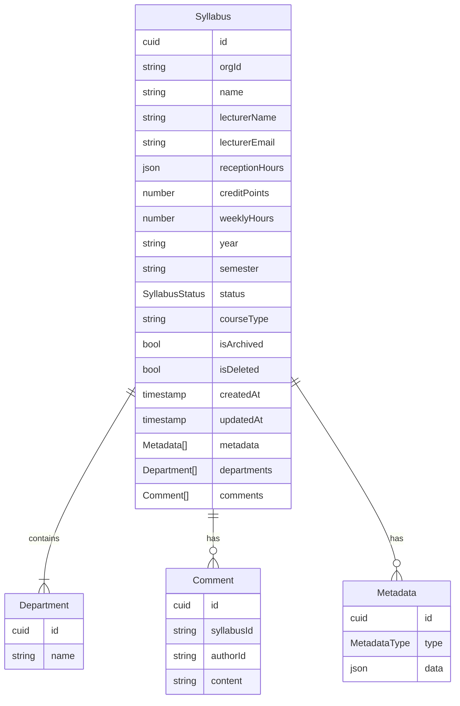

## Database enum values
```prisma
    enum SyllabusStatus {
      DRAFT
      PENDING_APPROVAL
      APPROVED
      REJECTED
    }
    
    enum MetadataType {
      COURSE_OBJECTIVES
      LEARNING
      TOPICS
      REQUIREMENTS
      SCORING
      ASSIGMENT_STRUCTURE
      BIBLIOGRAPHY
    }
```

## Tables




## JWT
```json
{
  "token": "eyJhbGciOiJSUzI1NiIsImNhdCI6ImNsX0I3ZDRQRDExMUFBQSIsImtpZCI6Imluc18ya3NZbjJwSVNDaUlUSjJDMXpITzNzZlhabHAiLCJ0eXAiOiJKV1QifQ.eyJhenAiOiJodHRwOi8vbG9jYWxob3N0OjMwMDAiLCJleHAiOjE3MzIxMTA4MzAsImZ2YSI6Wy0xLC0xXSwiaWF0IjoxNzMyMTEwNzcwLCJpc3MiOiJodHRwczovL3F1aWV0LWtpbmdmaXNoLTI4LmNsZXJrLmFjY291bnRzLmRldiIsImp0aSI6ImQ0MDU2YmVhZDcxNDA0NmY5YWRmIiwibmJmIjoxNzMyMTEwNzYwLCJvcmdfaWQiOiJvcmdfMm5zOFZyb293Mm5GWjdtOFhUUzIxTE9ielNRIiwib3JnX3Blcm1pc3Npb25zIjpbIm9yZzptb25leTpzaWduZXIiXSwib3JnX3JvbGUiOiJvcmc6YWRtaW4iLCJvcmdfc2x1ZyI6Im1hcmtldC1jb20iLCJzaWQiOiJzZXNzXzJvbm5TNEJkNHpkN01MMHdYR0hzTTVkNFBmSyIsInN1YiI6InVzZXJfMmtzWlFwamR4YUxOdmRHUFFBV1VHdFhpMDV2IiwidHdvX2ZhY3Rvcl9lbmFibGVkIjp0cnVlLCJ1c2VyX2lkIjoidXNlcl8ya3NaUXBqZHhhTE52ZEdQUUFXVUd0WGkwNXYifQ.gxm2pL3ow2_gJfp7Ri8i6E3jsVhfxHGgeASZPR1lyZjq6BsXn8_UrWwq0JqEa3KxdrrbRn3AyVbEkPQ-1-Vp7k7PCMHrX89Vgi22uDB3kcUFESP6TH7Y7AQnJ2ZkNm7OmfNSRySRIDqk6EtcLETseXgYkJLhk1pn3Jx9FYeMWuh4Lqmjw1XD6qaOLm7TlPuPZsN3UdDW5aVEcDPBcb0cpRYa25jYEA5I91_pJ3LClPoIqRU59QbPFOBN-0iFfrGMY6hd0cyZpuwLNhnh_l7xNTYBkV2oQqd2qGPrURvuUpoZJO75qaKVQt0rN8Wb0HXtJ4x5GGEE-l2gEx-d1zO8Dw"
}
```

## Clerk JWT payload example

```json
{
  "azp": "http://localhost:3000",
  "exp": 1732110830,
  "iat": 1732110770,
  "iss": "https://quiet-kingfish-28.clerk.accounts.dev",
  "jti": "d4056bead714046f9adf",
  "nbf": 1732110760,
  "org_id": "org_2ns8Vroow2nFZ7m8XTS21LObzSQ",
  "org_permissions": [
    "org:money:signer"
  ],
  "org_role": "org:admin",
  "org_slug": "market-com",
  "sid": "sess_2onnS4Bd4zd7ML0wXGHsM5d4PfK",
  "sub": "user_2ksZQpjdxaLNvdGPQAWUGtXi05v",
  "two_factor_enabled": true,
  "user_id": "user_2ksZQpjdxaLNvdGPQAWUGtXi05v"
}
```