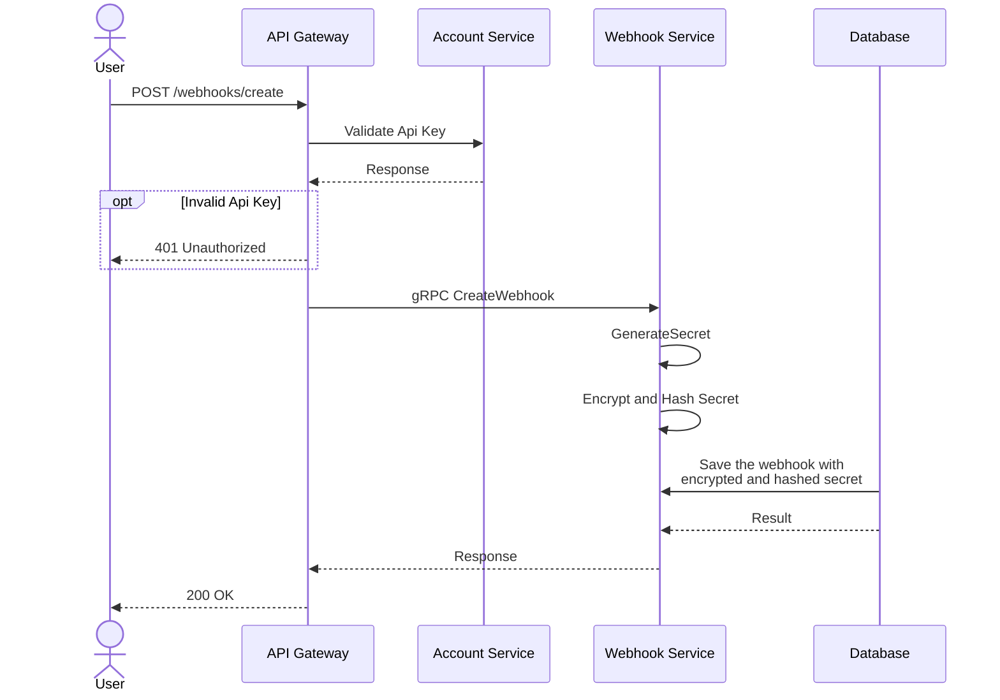
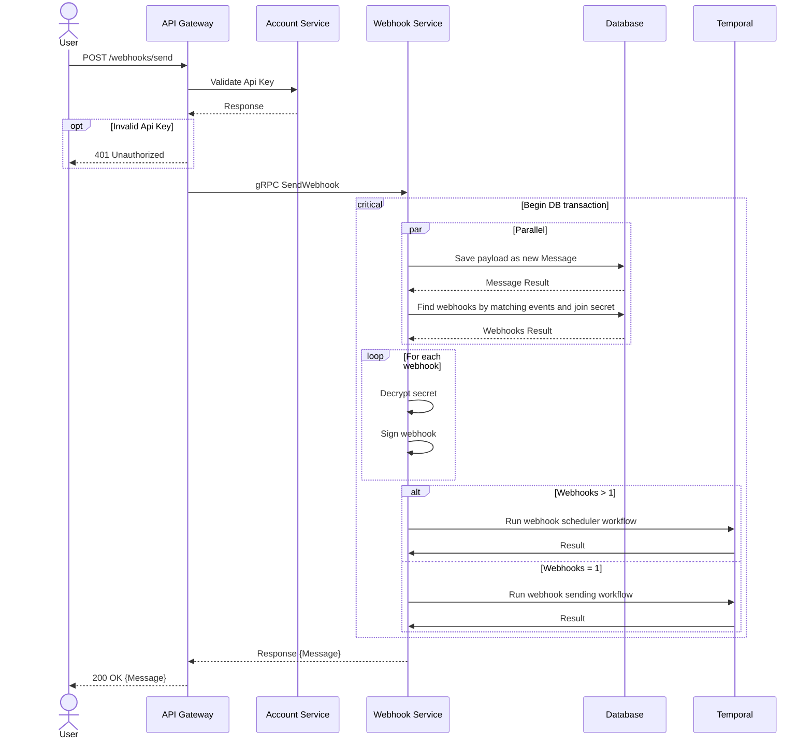

# Webhook Service API (gRPC)

## CreateWebhook RPC

```mermaid
sequenceDiagram
    actor User
    participant Gw as API Gateway
    participant Ac as Account Service
    participant Wh as Webhook Service
    participant Db as Database

    User ->> Gw: POST /webhooks/create
    Gw ->> Ac: Validate Api Key
    Ac -->> Gw: Response
    opt Invalid Api Key
        Gw -->> User: 401 Unauthorized
    end

    Gw ->> Wh: gRPC CreateWebhook
    Wh ->> Wh: GenerateSecret
    Wh ->> Wh: Encrypt and Hash Secret
    Db ->> Wh: Save the webhook with <br /> encrypted and hashed secret
    Db -->> Wh: Result
    Wh -->> Gw: Response
    Gw -->> User: 200 OK
```

## SendWebhook RPC

```mermaid
sequenceDiagram
    actor User
    participant Gw as API Gateway
    participant Ac as Account Service
    participant Wh as Webhook Service
    participant Db as Database
    participant Temporal as Temporal

    User ->> Gw: POST /webhooks/send
    Gw ->> Ac: Validate Api Key
    Ac -->> Gw: Response
    opt Invalid Api Key
        Gw -->> User: 401 Unauthorized
    end

    Gw ->> Wh: gRPC SendWebhook
    critical Begin DB transaction
        par Parallel
            Wh ->> Db: Save payload as new Message
            Db -->> Wh: Message Result
            Wh ->> Db: Find webhooks by matching events and join secret
            Db -->> Wh: Webhooks Result
        end
        loop For each webhook
            Wh ->> Wh: Decrypt secret
            Wh ->> Wh: Sign webhook
        end
        %% Lock/Use credits if implemented
        alt Webhooks > 1
            Wh ->> Temporal: Run webhook scheduler workflow
            Temporal ->> Wh: Result
        else Webhooks = 1
            Wh ->> Temporal: Run webhook sending workflow
            Temporal ->> Wh: Result
        end
    end
    Wh -->> Gw: Response {Message}
    Gw -->> User: 200 OK {Message}
```
