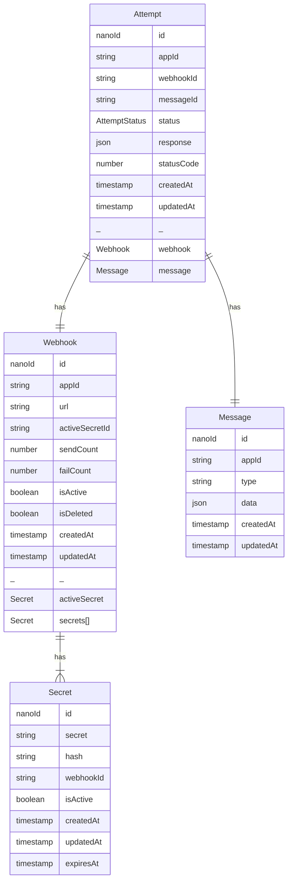

# Webhook Service Entities

```prisma
enum AttemptStatus {
    SUCCESS
    FAILED
}
```


```mermaid
    erDiagram
        Webhook {
            nanoId id
            string appId
            string url
            string activeSecretId
            number sendCount
            number failCount
            boolean isActive
            boolean isDeleted
            timestamp createdAt
            timestamp updatedAt
            _ _
            Secret activeSecret
            Secret secrets[]
        }

        Secret {
            nanoId id
            string secret
            string hash
            string webhookId
            boolean isActive
            timestamp createdAt
            timestamp updatedAt
            timestamp expiresAt
        }

        Message {
            nanoId id
            string appId
            string type
            json data
            timestamp createdAt
            timestamp updatedAt
        }

        Attempt {
            nanoId id
            string appId
            string webhookId
            string messageId
            AttemptStatus status
            json response
            number statusCode
            timestamp createdAt
            timestamp updatedAt
            _ _
            Webhook webhook
            Message message
        }

        Webhook ||--|{ Secret: has
        Attempt ||--|| Webhook: has
        Attempt ||--|| Message: has

```
